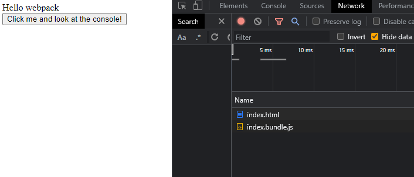
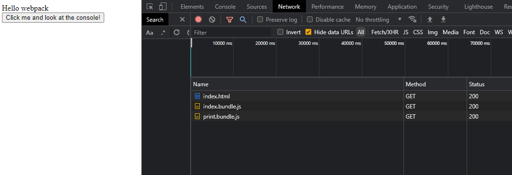

官方文档：
https://webpack.docschina.org/guides/lazy-loading/

## 代码分离的应用：懒加载
在代码分离中的例子基础上，进一步做些调整来说明这个概念。那里的代码确实会在脚本运行的时候产生一个分离的代码块 lodash.bundle.js ，在技术概念上“懒加载”它。

问题是加载这个包并不需要用户的交互 - 意思是每次加载页面的时候都会请求它。这样做并没有对我们有很多帮助，还会对性能产生负面影响。

我们增加一个交互，当用户点击按钮的时候用 console 打印一些文字。但是会等到第一次交互的时候再加载那个代码块（print.js）

print.js
```javaScript
console.log(
  'The print.js module has loaded! See the network tab in dev tools...'
);

export default () => {
  console.log('Button Clicked: Here\'s "some text"!');
};
```


注意当调用 ES6 模块的 import() 方法（引入模块）时，必须指向模块的 .default 值，因为它才是 promise 被处理后返回的实际的 module 对象。

效果：


